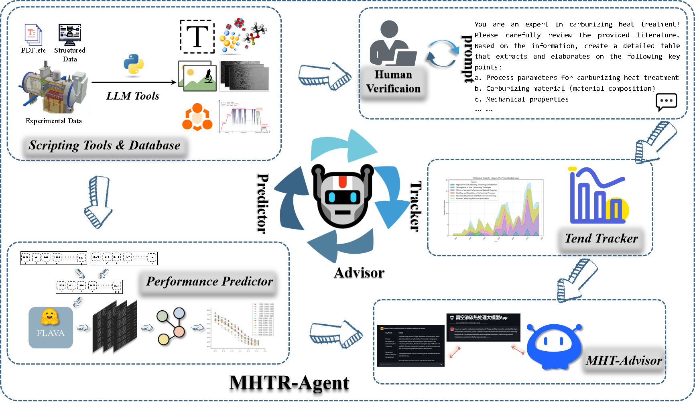
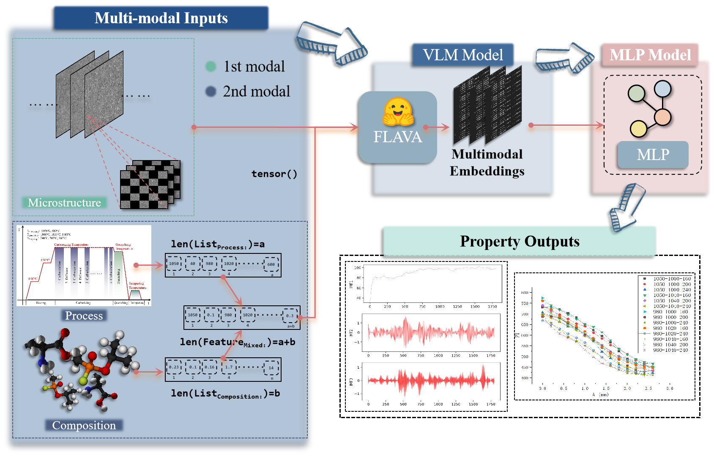

# 🤖 MHTR-Agent: A Novel Paradigm for Heat Treatment Research Based on Multimodal Analysis and LLMs

## Project Overview

MHTR-Agent is an innovative multimodal AI framework that combines large language models (LLMs) with data mining, machine learning, and multimodal analysis for materials science research. The framework aims to address challenges in the carburizing heat treatment process, enabling precise prediction of material properties and optimization of heat treatment parameters.

This project aims to promote collaboration between AI technologies and materials scientists by automating the analysis of the "composition–microstructure–performance" relationship and providing advanced tools for optimizing carburizing processes.



> The workflow for the MHTR-Agent includes the following components: "Scripting Tools and Database" for database construction, "Trend Tracker" for tracking development trends and frontier hotspots, "Performance Predictor" for predicting material microstructure and performance, and a multimodal intelligent advisor, "MHT-Advisor," built by integrating public and proprietary databases.

## Features

- **Multimodal Data Analysis**: Integrates text, tabular, and image data for high-precision material property prediction.
- **Performance Predictor**: Uses FLAVA vision-language models and neural networks to reduce the mean absolute error (MAE) of hardness prediction to 2.87 HV.
- **Trend Tracker**: Extracts and visualizes research trends and hotspots in heat treatment.
- **MHT-Advisor**: An intelligent assistant based on Retrieval-augmented Generation (RAG) technology, providing actionable advice and optimizing carburizing process parameters.



> Framework for Performance Predictor based on the multi-modal Cr13 steel database and a LLM named FLAVA. (1) Data preparation and processing, the first modal is the microstructure of the organization and the second modal is the structured data consisting of process parameters and material composition. (2) A neural network model consisting of a LLM called FLAVA and a multilayer perceptron with data flow done by multi-feature max. (3) Output predicted mechanical properties
---

## Core Achievements

- **High Prediction Accuracy**: Hardness prediction achieves an MAE of 2.87 HV, outperforming traditional methods.
- **Process Optimization**: Successfully optimized carburizing temperature and time using physics-informed neural networks (PINNs), reducing computation time by six orders of magnitude.
- **Comprehensive Data Coverage**: Built a multimodal dataset encompassing microstructure images, process parameters, and material compositions.

---

## System Workflow

- **Data Mining**: Extract unstructured data from scientific literature and experimental records.
- **Trend Analysis**: Use natural language processing to identify research trends and hotspots.
- **Performance Prediction**: Achieve high-accuracy material property prediction based on multimodal data.
- **Process Optimization**: Optimize heat treatment processes through finite element simulations and predictive algorithms.
- ... ... ... ... 

---

## Usage

### Prerequisites

Python 3.8 or higher  
Required libraries: torch, transformers, pandas, numpy, matplotlib, etc. (see `requirements.txt`)

### Installation

```bash
git clone https://github.com/NotUrNeighborMrWang/MHTR-Agent.git
cd MHTR-Agent
pip install -r requirements.txt
```
---

## Datasets

The dataset includes metallographic images, material compositions, and process parameters extracted from academic literature and experimental results. Please contact the project authors for access.

---

# Project Status

The code is being gradually uploaded and improved. Please stay tuned for updates and enhancements. Contributions are welcome!

---

# Acknowledgments

This project is supported by the following grants:

- Henan Academy of Sciences Start-up Research Fund
- Henan Provincial Science and Technology Research and Development Program Joint Fund

For more details, please refer to our research papers.

---

# License

This project is licensed under the MIT License - see the LICENSE file for details.

